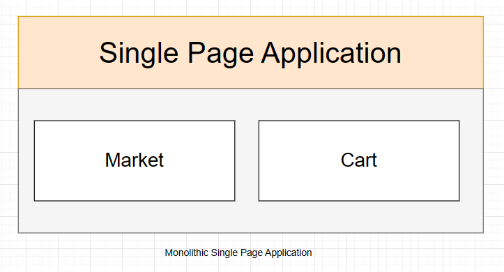
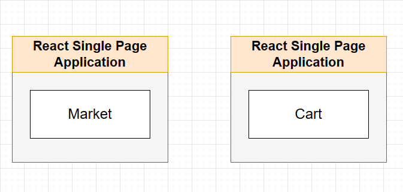
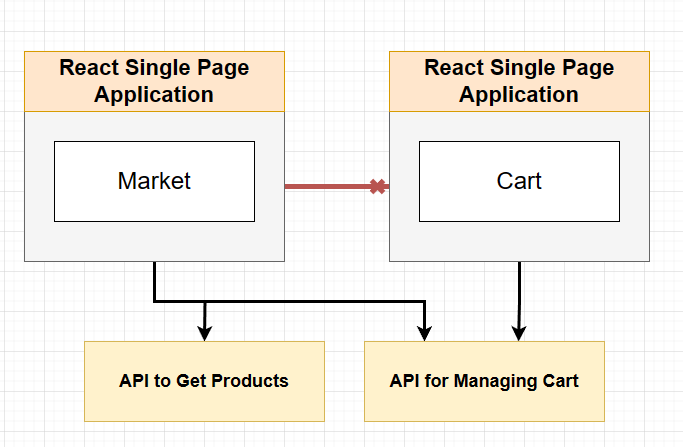
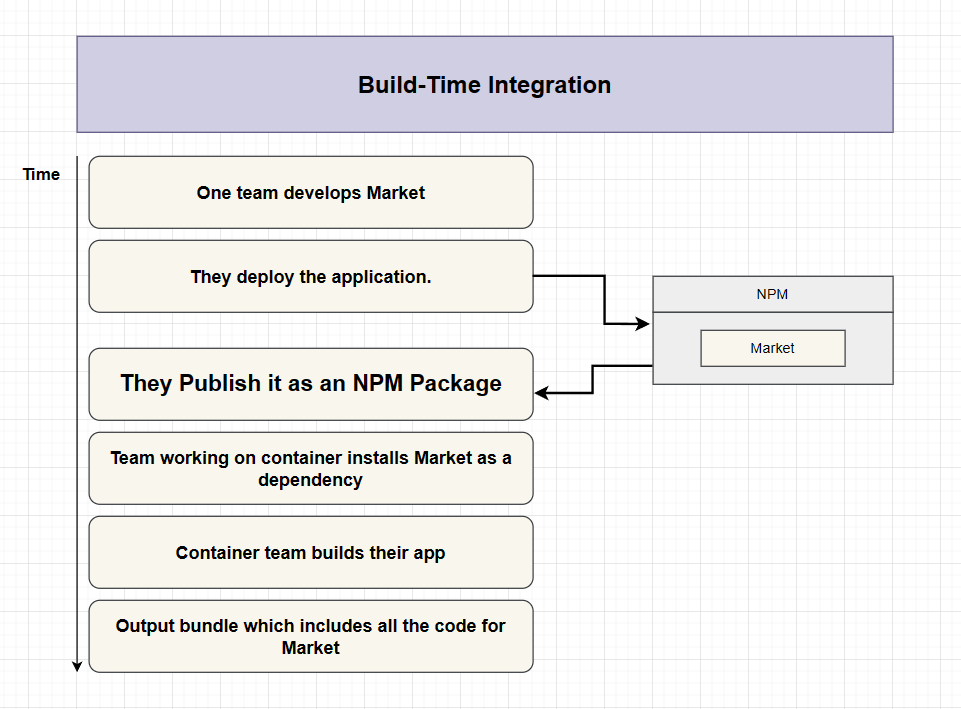
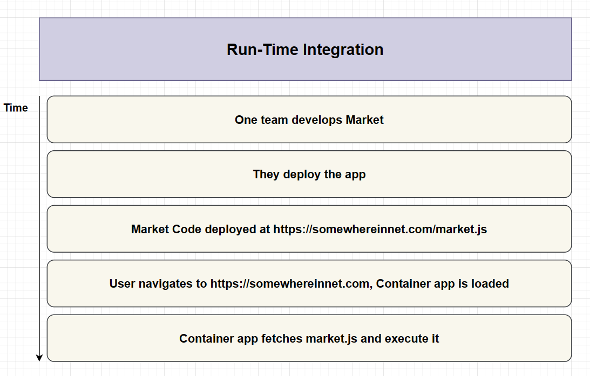
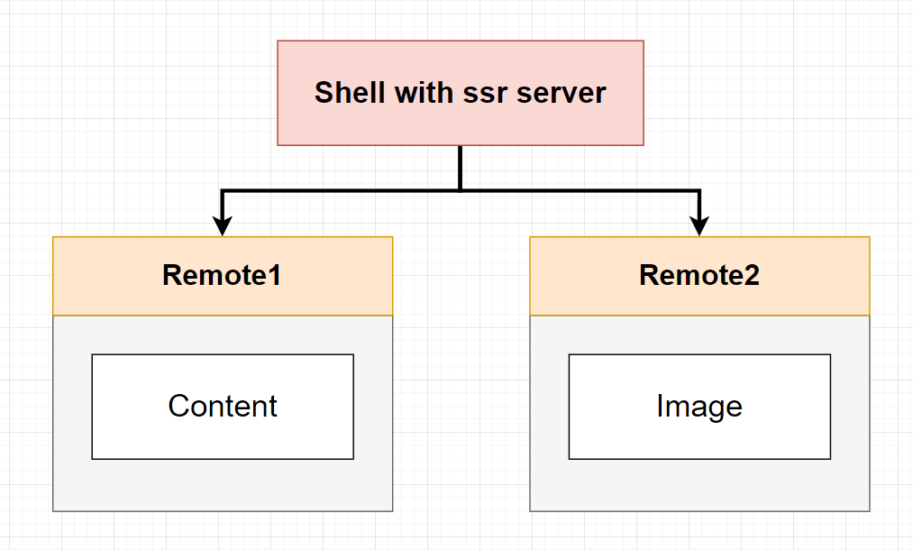
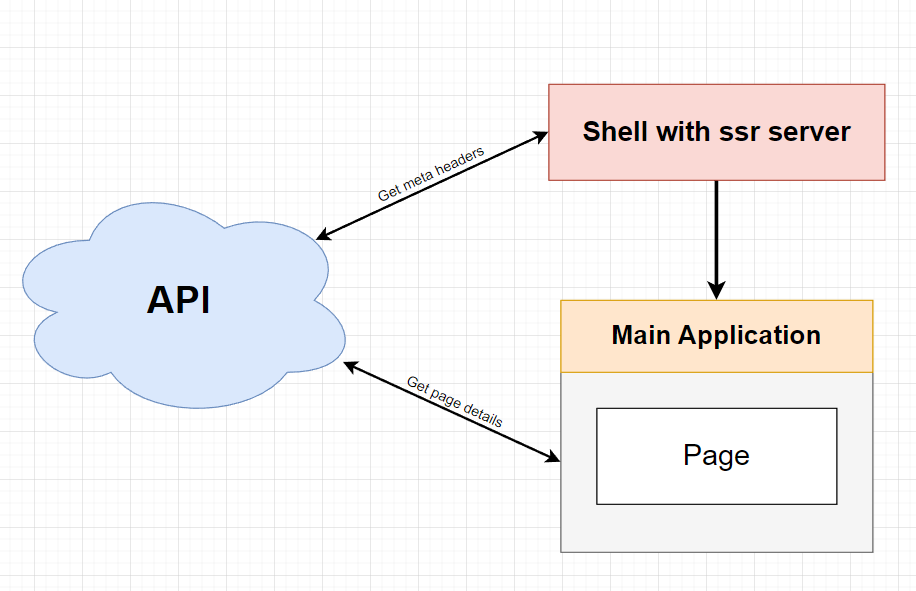

- [Microfrontend](#microfrontend)
  - [What is Microfrontend](#what-is-microfrontend)
      - [Advantages of using Microfrontends](#advantages-of-using-microfrontends)
      - [Disadvantages](#disadvantages)
  - [Different Categories of Integration](#different-categories-of-integration)
    - [Build-Time Integration](#build-time-integration)
      - [Advantages](#advantages)
      - [Disadvantages](#disadvantages-1)
    - [Run-Time Integration](#run-time-integration)
      - [Advantages](#advantages-1)
      - [Disadvantages](#disadvantages-2)
  - [Implementing](#implementing)
  - [Tools and Frameworks to handle Microfrontend projects better](#tools-and-frameworks-to-handle-microfrontend-projects-better)
    - [Webpack 5 Module Federation](#webpack-5-module-federation)
      - [react-18-ssr](#react-18-ssr)
    - [NWB](#nwb)
      - [➖ Disadvantages](#-disadvantages)
      - [➕ Advantages](#-advantages)
    - [Bit](#bit)
      - [➖ Disadvantages](#-disadvantages-1)
      - [➕ Advantages](#-advantages-1)
    - [AWS Serverless Microfrontends@edge](#aws-serverless-microfrontendsedge)
    - [Single-spa](#single-spa)
      - [➖ Disadvantages](#-disadvantages-2)
      - [➕ Advantages](#-advantages-2)
    - [PuzzleJS](#puzzlejs)
      - [➖ Disadvantages](#-disadvantages-3)
      - [➕ Advantages](#-advantages-3)
    - [OpenComponents](#opencomponents)
      - [➖ Disadvantages](#-disadvantages-4)
      - [➕ Advantages](#-advantages-4)
    - [SystemJS](#systemjs)
      - [➖ Disadvantages](#-disadvantages-5)
      - [➕ Advantages](#-advantages-5)
    - [qiankun](#qiankun)
      - [➖ Disadvantages](#-disadvantages-6)
      - [➕ Advantages](#-advantages-6)
    - [Piral](#piral)
      - [➖ Disadvantages](#-disadvantages-7)
      - [➕ Advantages](#-advantages-7)
    - [Lerna](#lerna)
      - [➖ **Disadvantages**](#-disadvantages-8)
      - [➕ Advantages](#-advantages-8)
    - [Microfrontend tools Summary](#microfrontend-tools-summary)

# Microfrontend
In this documentation, we will present some methods and ways to implement Micro Frontends. Since, there are lots of different approaches we can take, it is important to understand each of the approaches and their upsides and downsides.

In this documentation, we first take a look at different approaches and talk about their advantages and disadvantages. 

## What is Microfrontend
A micro frontend is an architecture pattern for building a scalable web application that grows with your development team and allows you to scale user interactions.

In simple terms we want to turn this simple ecommerce which is a monolithic application: 

To this micro frontend type:

Each of these single page applications (Market and Cart) are seperate applications which can be created with different Frameworks and developer teams can work on each of them separately without concern about possible conflicts.

With this approach, as long as we can, we should prevent direct connection between the sub-modules -which in this case are Market and Cart modules. We would instead try something like this: 

There is something named `Container` in this architecture which decides when/where to show each Microfrontend.

#### Advantages of using Microfrontends
- Different engineering teams can work on different parts of the project without being concerned about the possible conflicts
- Different parts of the application can be created with different approaches suited to different teams (Which should be managed, though)
- Different Single-page application can use even different engineering styles
- Implementing A/B tests can be easily handled
- Each smaller app is easier to understand and make changes to
- Unit testing is more meaningful.

#### Disadvantages
- The only disadvantage is about E2E tests. Implementing E2E tests in Micro frontend applications can be complex and usually cannot be similar to real-world experience.

## Different Categories of Integration
We need to make sure that container can have access to differet microfrontends we created. In our example, they are `Market` and `Cart`. This is called `integration` and there are multiple ways of doing it. 

We should have in mind, that there is no single perfect solution in integration. There are many solutions, and each of them have their pros and cons and we need to choose the one which suits our application needs better. 

Major categories of integration are: 

1. Build-Time Integration: Compile-Time Integration
2. Run-Time Integration: Client-Side Integration
3. Server Integration

### Build-Time Integration
Also known as Compile-Time Integration, gets access to microfrontend (like `Market`), **before** container gets loaded in the browser. The following is one example of Build-Time Integration:

#### Advantages
- Easy to setup and easy to understand the code

#### Disadvantages
- Container has to be re-deployed every time a microfrontend is updated
- Container has full access to sub-module source code which is tempting to tightly couple the Container and microfrontend

### Run-Time Integration
Also known as Client-Side Integration, gets access to microfrontend (like `Market`), **after** container gets loaded in the browser. This way is the more usual ways which being used more in action these days. The following digram is an example of Run-Time Integration: 

Run-Time Integration can be implemented using `Webpack Module Federation`. This is the most flexible and performant solution around right now according to the most courses for Microfrontend architecture. 

Setting up the container, needs us to be skilled in `webpack`.

#### Advantages
- the microfrontend (for example Market sub-module in our case) can be deployed independently at any time
- Different versions of the microfrontend (for example Market) can be deployed and Container can decide which one to use

#### Disadvantages
- Tooling and setup is more complicated than the other method

## Implementing
In this section we focus on handling implementation what we want and discuss the solutions and possible methods to handle the project better.

## Tools and Frameworks to handle Microfrontend projects better
In this section we will provide some overviews about the frameworks and tools which can help us to build Microfrontend architecture. Each of these tools are using either run-time integration or build-time integration. We should keep in mind that these tools won't remove the method disadvantages and they are just built to make the development easier.

### [Webpack 5 Module Federation](https://github.com/module-federation/universe/tree/main)
One method of implementing Run-time Integration is using Webpack module federation. There are tons of useful examples [here](https://github.com/module-federation/module-federation-examples). The most useful ones for our approach are: 

- [react-18-ssr](https://github.com/module-federation/module-federation-examples/tree/master/react-18-ssr)
- [nextjs-ssr](https://github.com/module-federation/module-federation-examples/tree/master/nextjs-ssr)
- [nextjs-react](https://github.com/module-federation/module-federation-examples/tree/master/nextjs-react)

We can use each of the above examples. All of them are Run-time integration. Therefore, on each change and with a good CI/CD pipeline, on every change the whole application would change.

#### [react-18-ssr](https://github.com/module-federation/module-federation-examples/tree/master/react-18-ssr)
Our application is using react-18. One possible way is to use a `ssr-host` and then add different parts of the application, using remote applications. In the example provided by `Module Federation`, There is a shell which hosts the application (it is the container) and includes SSR server.

There are `remote1` and `remote2` which are react applications. `remote1` is an standalone application, exposes `Content` component and consumes `Image` from `remote2`. And there is `remote2` which is a standalone application, exposes `Image` component.

On our problem, with the same method, we can create a `ssr-shell` as a host. Then multiple remote applications. One of the remotes can be the main application. 

In this approach, we fetch corresponding data from API in the main application and the host simultaneously, then the shell host renders them server side. 

----

### [NWB](https://github.com/insin/nwb)
NWB is a toolkit for React, Preact, Inferno & vanilla JS apps, React libraries and other npm modules for the web, with no configuration. If we choose the build-time integration, we can use this tooling to create our packages more easily. Although, it won't help us on managing Microfrontend applications because in the end, we need to create a container as the host.

That host, needs to be `SSR` or anything else according to our needs. 

Regarding disadvantages of `Built-time Integration`, `NWB` won't help with any of them. After each update to the sub-modules, we need to re-deploy the container to see the changes. Furthermore, the whole source code of the sub-module (the Microfrontend we add to the main project) will be available through the main container which is not a very good practice in Microfrontend architecture.

#### ➖ Disadvantages
- Old. last commit is for 2 years ago.
- Does not help us with microfrontend architecture itself

#### ➕ Advantages
- Provide goold toolings to create JavaScript packages

---

### [Bit](https://bit.dev/)
Bit is a Build-Time integration Framework. Bit provides a full framework, including CI/CD pipeline. It takes separate components and builds them into micro-frontends. Bit is similar to Webpack that it works in Build time. However, with the Module Federations Plugin, Webpack has an advantage of Run-Time integration, as well, which makes components are more decoupled.

According to Bit, this tool is an open-source tool for composing component-driven software. And these components, can be as big as modern web applications, e-commerce shops, large building blocks like a Blog and etc. And they can also be as small as simple UI components like Header, Footer, and etc. 

This tool does not predescribe how to build the entire application. It helps you define and compose components and allows for every component to adopt the dev tools that best fit its nature. Bit offers native support for various dev tools like `Typescript`, `Babel`, `Jest`, `Webpack`, `ESLint` and ready made development environments for different frameworks like React, NodeJS, Angular, vue and more. 

This tool is open-source, updates regularly, has great documentation and also easy to use.

#### ➖ Disadvantages
- It is some sort of framework which has its own learning curve
- Requires configuring and ensuring cosistent component isolation

#### ➕ Advantages
- Great documentation
- Component-driven development with easy sharing and reuse of components
- Allows for independent versioning and management of components
- Supports integration during the build process through component dependencies

---

### [AWS Serverless Microfrontends@edge](https://youtu.be/fT-5RHTtFNg)
AWS Severless Micro-Frontends at the Edge: In this approach, AWS make use of their CDN (AWS CloudFront) and Lambda@Edge. The orchestration will happen on the CDN itself, instead of the Client-Side or Server-Side. More about this at [this youtube clip](https://youtu.be/fT-5RHTtFNg).

The problem with this approach is -under our circumstances- using `AWS` may not be a suitable option for developing. 

---

### [Single-spa](https://single-spa.js.org/docs/getting-started-overview)
Single-spa is a framework for bringing together multiple JavaScript microfrontends in a frontend application. They have an [example](https://single-spa.js.org/docs/examples) page which has different implementation for different frameworks. 

single-spa consist of the following: 
- A single-spa root config, which renders the HTML page and the javascript that registers applications. Each application is registered with three things: 
  - A name
  - A function to load the application's code
  - A function that determines when the application active/inactive
- Applications which can be thought of as single-page applications packaged up into modules. Each application must know how to bootstrap, mount, and unmount itself from the DOM. The main difference between a traditional SPA and single-spa applications is that they must be able to coexist with other applications as they do not each have their own HTML page.

This tool have a good documentation and can be integrated at runtime via iframes or JavaScript or at Build-Time Integration.

#### ➖ Disadvantages
- Increased Complexity: Single-SPA requires developers to understand and manage the complexities of inter-application communication, routing, and state management.
- Performance Overhead: Since Single-SPA relies on dynamic loading and rendering of microfrontends at runtime, it can introduce performance overhead due to additional network requests and initial loading times. Careful optimization and caching strategies are necessary to mitigate these performance concerns.
- Integration Challenges: Integrating multiple independently developed microfrontends can be challenging, especially when dealing with shared dependencies, routing conflicts, and state management. Proper coordination and collaboration between teams are crucial to ensure smooth integration.
- Learning Curve: Single-SPA introduces a learning curve, especially for developers who are new to microfrontend concepts. Familiarity with the framework, configuration, and best practices is required to effectively utilize Single-SPA.

#### ➕ Advantages
- Independence: Single-SPA allows individual microfrontends to be developed, deployed, and updated independently. This independence enables different teams to work on separate parts of the application without tightly coupling their development processes.
- Framework Agnostic: Single-SPA is framework-agnostic, meaning it can work with different frontend frameworks such as React, Angular, Vue.js, and more. This flexibility allows us to choose the best framework for each microfrontend, depending on its requirements and the team's preferences.
- Code Sharing: Single-SPA supports code sharing between microfrontends, reducing duplication and promoting reusability. Shared libraries, utilities, and components can be created and consumed by multiple microfrontends, leading to improved development efficiency.
- Run-time Integration: Single-SPA facilitates run-time integration, meaning that microfrontends are loaded and rendered dynamically in the browser at runtime. This approach allows for more flexible and dynamic composition of microfrontends, making it easier to add, remove, or update components without requiring a full application rebuild.

---

### [PuzzleJS](https://github.com/puzzle-js/puzzle-js)
Another JavaScript framework for building microfrontends. It allows us to create reusable, composable components that can be shared across multiple applications.

#### ➖ Disadvantages
- Limited documentation: Compared to more established frameworks like Single-SPA, PuzzleJS has limited documentation and community support.
- Limited ecosystem: PuzzleJS has a limited ecosystem of plugins and tools compared to other microfrontend frameworks.
- Limited adoption: PuzzleJS is a relatively new framework and hasn't been widely adopted yet, which means that there are fewer resources and examples available.

#### ➕ Advantages
- Reusability: PuzzleJS allows you to create reusable components that can be shared across multiple applications, which can reduce development time and improve consistency.
- Integration with existing applications: PuzzleJS can be integrated with existing applications, which makes it easier to adopt and use.
- Simplified development: PuzzleJS provides a simple and intuitive API for creating and managing components, which can make development faster and easier.
- No runtime dependency: PuzzleJS doesn't have any runtime dependency, which means that it can be used with any JavaScript framework or library.

---

### [OpenComponents](https://github.com/opencomponents/oc)
Is a JavaScript microfrontend tool developed by OpenTable. It allows us to create and integrate reusable, standalone components across different applications or services. The integration approach of OpenComponents is Run-Time Integration. components are rendered dynamically in the browser, allowing for flexible composition and runtime updates. However, OpenComponents can also be combined with other Build-Time integration tools like module bundlers or package managers to optimize performance and dependency management during the build process.

#### ➖ Disadvantages
- Learning Curve: As with any new tool or framework, there may be a learning curve associated with OpenComponents, especially if we are not familiar with its specific concepts and development practices.
- Limited Ecosystem: Compared to more widely adopted microfrontend frameworks, OpenComponents may have a smaller ecosystem and community support. This can impact the availability of ready-to-use components and resources.

#### ➕ Advantages
- Reusability: OpenComponents promotes component reusability by enabling us to build independent components that can be shared and consumed across multiple applications. This can lead to faster development, improved consistency, and easier maintenance of UI elements.
- Isolation: OpenComponents emphasizes component isolation, which means each component is self-contained and doesn't have dependencies on the hosting application. This isolation enables components to be developed and updated independently without affecting the rest of the application.
- Versioning and Dependency Management: OpenComponents supports versioning and dependency management for components. This allows different applications to use different versions of a component based on their specific requirements. It also ensures that updates to components can be rolled out gradually and in a controlled manner.
- Runtime Integration: OpenComponents primarily focuses on runtime integration. Components are loaded and rendered dynamically in the browser at runtime, enabling flexible composition and dynamic updates without requiring a full application rebuild.
---

### [SystemJS](https://github.com/systemjs/systemjs)
This tool is a JavaScript module loader that allows us to load module written in different module formats (e.g. CommonJS, AMD, ES6) in the browser. It provides a flexible and configurable way to load modules at runtime, which can be useful for building dynamic applications and microfrontends. SystemJS is Run-Time Integration.

SystemJS can be used for creating microfrontend architecture in a number of ways. One way is to use SystemJS to load the microfrontends as separate modules. This allows the microfrontends to be loaded on demand, which can improve the performance of the application. Another way to use SystemJS for microfrontends is to use it to create an import map. An import map is a file that maps module anmes to URLs. This can be used to load the microfrontends from different locations, which can help to improve the flexiblity of the architecture.

#### ➖ Disadvantages
- It can be complex to configure. SystemJS can be a complex library to configure, which can be a barrier to entry for some developers.
- It is not a silver bullet. SystemJS is not a magic solution that will solve all of the problems associated with microfrontends. 

#### ➕ Advantages
- It allows for dynamic loading of modules. This can help to improve the performance of a web application by loading only the modules that are needed.
- It is flexible. SystemJS can be used to load modules from different locations, which can help to improve the flexibility of the microfrontend architecture.
- It is easy to use. SystemJS is a relatively easy library to use, which can make it a good choice for developers who are new to microfrontends.

---

### [qiankun](https://github.com/umijs/qiankun)
Qiankun is a JavaScript library that is used to create microfrontend architectures. It is based on the single-spa specification, which defines a way to load and manage multiple independent frontend applications within a single browser window.

Qiankun provides a number of features that makes it easy to create microfrontends, including:

- **Sandboxing**: Each microfrontend is isolated in its own sandbox, which prevents them from interfering with each other.
- **Preloading**: Microfrontends can be preloaded, which can improve the performance of the application.
- **Hot reloading**: Micrfrontends can be hot reloaded, which means that they can be updated without the need to reload the entire application.
- **Routing**: Qiankun provides a routing system that allows users to navigate between microfrontends.

This library is a Run-Time integration tool.

#### ➖ Disadvantages
- Complexity: Qiankun can be complex to set up and use, especially for beginners.
- Learning curve: There is a learning curve to using Qiankun, which can be a barrier to entry for some developers.

#### ➕ Advantages
- Scalability: Qiankun can be used to create large and complex microfrontend architectures.
- Performance: Qiankun can improve the performance of a web application by loading only the microfrontends that are needed.
- Flexibility: Qiankun is a flexible library that can be used with a variety of frameworks and technologies.

---

### [Piral](https://github.com/smapiot/piral)
Piral is a JavaScript framework that helps us build microfrontends. It is a Build-Time Integtarion tool that allows us to create independent components that can be composed together to create larger applications.

Pirals are small, independent frontend applications that can be combined to create a larger application. Piral can be used to create microfrontends by allowing us to create independent components that can be composed together.

Pirals are built using the Web Components standard, which means that they can be integrated into any web application. Pirals can be integrated at build time or run time, depending on our preferences.

This framework is a Build-Time integration tool.

#### ➖ Disadvantages
- It can be complex to set up and use. Piral is a powerful tool, but it can be complex to set up and use. This can be a barrier to entry for some developers.

#### ➕ Advantages
- It makes it easy to create and manage independent components. Piral provides a number of tools that make it easy to create, manage, and share independent components. This can save a lot of time and effort when creating and maintaining microfrontends.
- It allows for independent development of microfrontends. Each microfrontend can be developed and deployed independently, which can help to improve the speed and agility of development.
- It can help to improve the performance of microfrontends. By loading only the microfrontends that are needed, Piral can help to improve the performance of a web application.
---

### [Lerna](https://lerna.js.org/docs/getting-started)
Lerna is a fast, modern build system for managing and publishing multiple JavaScript/TypeScript packages from the same repository. We can use them to handle the host repository which includes multiple remote app. [Guide](https://www.digitalocean.com/community/tutorials/how-to-manage-monorepos-with-lerna)

Lerna can be used for creating microfrontend architecture. Lerna can be used to manage the microfrontends in a monorepo, which can make it easier to develop, deploy, and maintain them.

This way, Lerna is considered a Build-Time integration tool.

#### ➖ **Disadvantages**
- Not specifically designed for Microfrontend

#### ➕ Advantages
- A great tool to manage monorepos
- Easy to use
- Great documentation

---

### Microfrontend tools Summary

|       Tools               | Build-Time Integration  | Run-Time Integration  | ⭐ Github Stars |
|---------------------------|-------------------------|-----------------------|-----------------|
|Webpack 5 Module Federation|❌|✅|⭐ 63.3k|
|NWB                        |✅|❌|⭐ 5.6k|
|Bit                        |✅|❌|⭐ 16.8k|
|Single-spa                 |❌|✅|⭐ 12.5k|
|Puzzle-js                  |❌|✅|⭐ 585|
|OpenComponents             |✅|✅|⭐ 1.3k|
|SystemJS                   |❌|✅|⭐ 12.6k|
|qiankun                    |❌|✅|⭐ 14.6k|
|Piral                      |✅|✅|⭐ 1.5k|
|Lerna                      |✅|❌|⭐ 34.7k|
